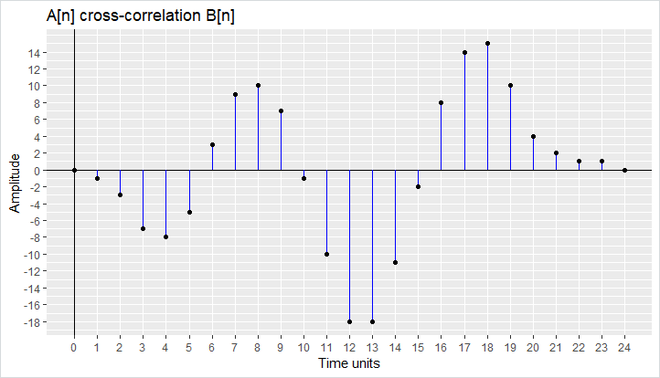

This week I was able to use my library, especially the *ggplot2* part, for an exercise on signal processing we had to do in another course. The goal was to calculate and visualise the output of different functions on two input signals, e.g. cross-correlation or convolution. This is an example code I wrote in R:

```r
ggplot(matrix, aes(X, cross_cor_A_B)) +
  geom_hline(yintercept = 0) + 
  geom_vline(xintercept = 0) + 
  geom_segment(aes(xend=X, yend=0), color = "blue") + 
  geom_point() + 
  ggtitle("A[n] cross-correlation B[n]") + 
  labs(x="Time units", y="Amplitude") +
  scale_x_continuous(minor_breaks = X, breaks = X) + 
  scale_y_continuous(breaks = seq(min(cross_cor_A_B), max(cross_cor_A_B), by=2))
```

And it generated the following graph of the cross-correlation (given the variables are defined...):



**R4DS Chapter 14: Strings**

